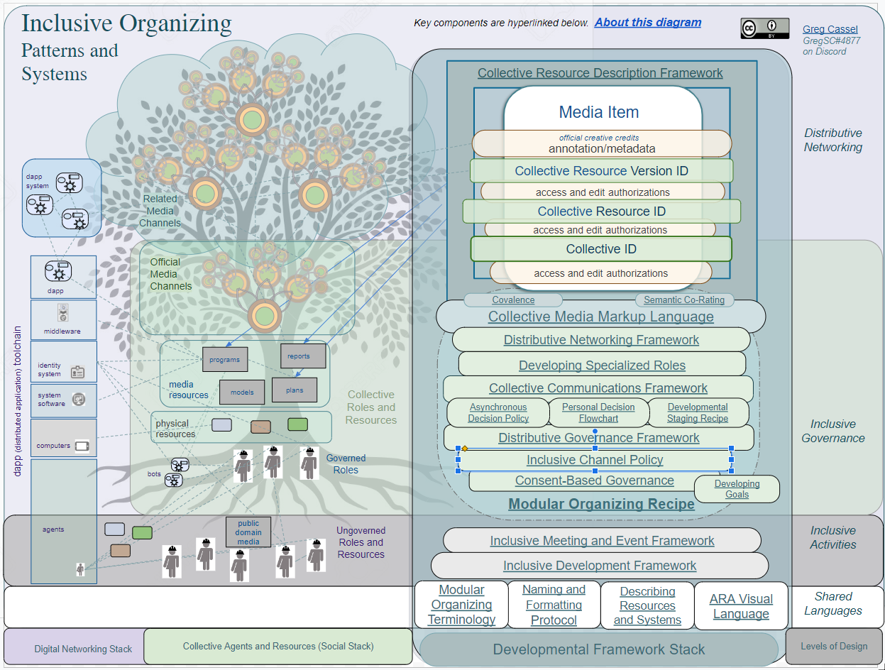

# IO Landing Page

## Introductory

### Mission

_What is the_ [_primary_](https://github.com/gcassel/Modular-Organizing-Terminology/blob/master/terms/base.md) __ [_goal_](https://github.com/gcassel/Modular-Organizing-Terminology/blob/master/terms/goal.md) _which_ [_defines_](https://github.com/gcassel/Modular-Organizing-Terminology/blob/master/terms/define.md) _your_ [_project_](https://github.com/gcassel/Modular-Organizing-Terminology/blob/master/terms/project.md)_?  Mission should be identifiable as action in which the project either maintains or changes one or more resources of interest to the project stewards and others.  Mission may be perceived as vision, purpose, intent or goal.)_

_\_\_\_\_\_\_\_\_\_\_\_\_\_\_\_\_\_\_\_\_\_\_\_\_\_\_\_\_\_\_\_\_\_\_\_\_\_\_\_\_\_\_\_\_\_\_\_\_\_\_\_\_\_\_\_\_\_\_\_\__

_IO's Mission:_ To provide templates, guidelines and standard operating procedures (or recipes) for _inclusively, methodically and scalably_ developing all types of _projects, collectives and networks_, including distributed computing networks.

### Storyline/ how it connects to nature

_**(Should we rename this as Vision? )** Tell us a story about the world in which your project has successfully performed or completed its mission._

The central concept of IO is that we can develop inclusive organizing activities and structures consistently and efficiently by methodically developing IO’s four _levels of design_: _inclusive language, activity, governance,_ and _distributive networking_. Shared languages are seen as the basis of all inclusive activities. Inclusive activities-- that is, _inclusive discussion, design and decision--_ are seen as the source of inclusive governance processes, which can lead to distributive networking which intentionally distributes governance authority, as well as other shareable resources. Projects can develop policies and policy design tools at any of these four levels in any order. This author believes that we will need to develop awareness and support of the full “four level stack” to develop inclusively at the unlimited scales and complexities which we will ultimately need in order to harness humanity’s collective wisdom potentials, and to sustainably survive and thrive as a species in reciprocal relations with others. However, IO is named in the plural (“Systems”) to emphasize its pluralism, and the diverse potential pathways to formal developments within the general community (and, when applicable, technical networks) of each project.

### Problem / Solution

_Can you describe your Project's Mission as the story of a key Problem and its Solution?_

Problem: The core problem perceived here is centralized bureaucracies which gather political and/or economic power, and externalize the costs of their activities to ecosystems, workers and consumers. \\

The solution: IO prioritizes low-tech practices which don’t depend on any highly specialized software or tech platforms, but can be directly integrated with many platforms and systems. \\

IO as a whole is represented by a visual diagram and directory:

\\

This diagram represents four _technical stacks:_

1. _levels of design_
2. _developmental frameworks_ which support those _levels of design_
3. _social relationships_
4. _digital networking_ which can improve the efficiency and scalability of organizing activities

The central concept of IO is that we can develop inclusive organizing activities and structures, including any or all of the four technical staks, consistently and efficiently by _methodically practicing_ IO’s four _levels of design_: _inclusive language, activity, governance,_ and _distributive networking_. Shared languages are seen as the basis of all inclusive activities. Inclusive activities-- that is, _inclusive discussion, design and decision--_ are seen as the source of inclusive governance processes, which can lead to distributive networking which intentionally distributes governance authority, as well as other shareable resources. Projects can develop policies and policy design tools at any of these four levels in any order. This author believes that we will need to develop awareness and support of the full “four level stack” to develop inclusively at the unlimited scales and complexities which we will ultimately need in order to harness humanity’s collective wisdom potentials, and to sustainably survive and thrive as a species in reciprocal relations with others. However, IO is named in the plural (“Systems”) to emphasize its pluralism, and the diverse potential pathways to formal developments within the general community (and, when applicable, technical networks) of each project.

The heart of IO is its _Developmental Framework Stack_ which is a framework of other models and recipes for the inclusive development of projects, networks and digital media resources. Each of IO’s component frameworks can provide any or all of the project’s constitutional policies and _policy design tools_ at each level of design, facilitating the development of inclusively distributiveactivities on increasing scales of magnitude and complexity. [**CMML**](https://docs.google.com/document/d/1sQGDXBpM9X\_FOmsEsA69CvuD9iuKtGAi0NXy9ba0gdI/edit#heading=h.hkdj6mlvdrk0) and [**Collective Resource Description Framework**](https://docs.google.com/document/d/1sQGDXBpM9X\_FOmsEsA69CvuD9iuKtGAi0NXy9ba0gdI/edit#heading=h.cqh15rqntkkd) (CRDF) is the culmination of the Developmental Framework Stack in IO. CRDF is meant to facilitate deeply distributive digital networking, and thepeer-to-peer development ofeffectivelynetworked _collective digital media_[ \_\_ ](https://github.com/gcassel/Modular-Organization-Terminology/blob/master/terms/resource.md)_resources_, includingdistributed databases,discussionforums andpersistentcommunicationschannels

IO also has a _Social Stack_ which represents relationships between the primary types of agents and resources which the Organizational Development Stack can serve and support. For example, projects develop both governed and ungoverned participant roles (including voting membership roles) which may use or modify the project’s media resources and, when applicable, the physical resources which they represent. It’s especially important for key participants to support one or more media channels for collectively-supported interactions, including the use and updating of constitutional policies and policy design tools. Channels may include any number of digital formats as well as meeting and event programs. Projects may develop a number of official media channels while also actively supporting other, related channels, including ones which are either ungoverned or are governed by different people and groups. All of these media channels can be methodically networked to improve navigability and efficiency of usage, per [Collective Communications Framework](https://docs.google.com/document/d/1\_KwMbdghVVv1FODuy21QsXXXHsAKTLGc0YGT64oh0mg/edit#heading=h.54681qu4rgu) and other developmental frameworks.\
\
IO also depicts a _Digital Networking Stack_ which represents hardware and software components which work together to run applications. IO specifically represents dapps (distributed applications) because (1) they require special networking techniques, and (2) this author believes that they’re crucial to developing massively inclusive and scalable global projects which govern and host many media items, including their own policies and policy design tools.

#### How IO Compares to Analogous Projects

Compared to many projects which are centrally developed in a unitary fashion, IO is an intentionally generic set of patterns and recipes for inclusively developing agreements and organizations in a variety of methodical, step-by-step options. It's a framework for developing agreements and organizations in all social contexts: within groups, between groups, between individuals and groups, and peer-to-peer. It’s a framework for developing exploratory discussion and media-sharing networks, as well as work agreements andeconomic commitments.

### Product(Goods/ Services)

IO consists of several dozen open source “developmental framework” modules including recipes and templates for developing projects and networks. These modules are being moved into this Gitbook collection. The modules can be used separately and/or together. Some of them are closely linked to each other-- even requiring cross-reference in some cases. Others are only indirectly related, but can serve one or more of IO’s four levels of design in the same project or network.

#### Use Cases

_WIP:_

* _include the one generic example from P2PDN Verbal Overview, and three or more other specific examples. **at least 3 , preferably 6 or more**_
* _eventually, link reported real uses_
* _use **thought exercise examples** of how complex networks (each with one specific goal) could develop through this framework of frameworks_
* _sequentially increase complexity in each example_
* _illustrate most aspects of Distributive Governance Framework in at least one example_
* _include at least one hierarchical and federated relationship in each example_
* _depict modularity and distributed version control in at least one example_
* _include distributed database in the final example_

_**Current generic example from**_ [_**P2PDN**_](https://docs.google.com/document/d/1O7tJQVMHETSoWRpYC9eYsqi58ELL0Euv6L6d21LC6m0/edit#heading=h.f01q2uhdhbpn)_**:**_\\

**The following description provides a high level overview of recommended p2p elements, forms and processes for developing massively inclusive and scalable collectives and networks:**

**Receive/Send Authorization**

_People_ [_socially_](https://github.com/gcassel/Modular-Organizing-Terminology/blob/master/terms/social.md) \_\_ [_organize_](https://github.com/gcassel/Modular-Organizing-Terminology/blob/master/terms/organize.md) _as_ [_digital_](https://github.com/gcassel/Modular-Organizing-Terminology/blob/master/terms/digital.md) \_\_ [_identities_](https://github.com/gcassel/Modular-Organizing-Terminology/blob/master/terms/identity.md) _which_ [_authorize_](https://github.com/gcassel/Modular-Organizing-Terminology/blob/master/terms/authorize.md) _each other to_ [_receive_](https://github.com/gcassel/Modular-Organizing-Terminology/blob/master/terms/receive.md) \_\_ [_data_](https://github.com/gcassel/Modular-Organizing-Terminology/blob/master/terms/data.md) _from and (sometimes)_ [_send_](https://github.com/gcassel/Modular-Organizing-Terminology/blob/master/terms/send.md) _data to_ [_specific_](https://github.com/gcassel/Modular-Organizing-Terminology/blob/master/terms/specific.md) \_\_ [_signal_](https://github.com/gcassel/Modular-Organizing-Terminology/blob/master/terms/signal.md) \_\_ [_channels_](https://github.com/gcassel/Modular-Organizing-Terminology/blob/master/terms/channel.md)_, using_ [_secure_](https://github.com/gcassel/Modular-Organizing-Terminology/blob/master/terms/secure.md) \_\_ [_p2p_](https://github.com/gcassel/Modular-Organizing-Terminology/blob/master/terms/p2p.md) _signaling_ [_standards_](https://github.com/gcassel/Modular-Organizing-Terminology/blob/master/terms/standard.md) _for both_ [_streaming_](https://github.com/gcassel/Modular-Organizing-Terminology/blob/master/terms/stream.md) _and_ [_messaging_](https://github.com/gcassel/Modular-Organizing-Terminology/blob/master/terms/message.md)_._

**View/Edit Authorization**

_People simultaneously organize as_ [_viewers_](https://github.com/gcassel/Modular-Organizing-Terminology/blob/master/terms/view.md) _and_ [_editors_](https://github.com/gcassel/Modular-Organizing-Terminology/blob/master/terms/edit.md) _of data_ [_storage addresses_](https://github.com/gcassel/Modular-Organizing-Terminology/blob/master/compound-terms/storage-address.md) _and_ [_storage_](https://github.com/gcassel/Modular-Organizing-Terminology/blob/master/terms/store.md) \_\_ [_locations_](https://github.com/gcassel/Modular-Organizing-Terminology/blob/master/terms/location.md)_. Storage location editors_ [_distribute_](https://github.com/gcassel/Modular-Organizing-Terminology/blob/master/terms/distribute.md) _viewing and editing rights to_ [_develop_](https://github.com/gcassel/Modular-Organizing-Terminology/blob/master/terms/develop.md) \_\_ [_collective_](https://github.com/gcassel/Modular-Organizing-Terminology/blob/master/compound-terms/group-agent.md) \_\_ [_media_](https://github.com/gcassel/Modular-Organizing-Terminology/blob/master/terms/media.md) \_\_ [_resource_](https://github.com/gcassel/Modular-Organizing-Terminology/blob/master/terms/resource.md) \_\_ [_items_](https://github.com/gcassel/Modular-Organizing-Terminology/blob/master/terms/item.md)_. This enables the development of_ [_complex_](https://github.com/gcassel/Modular-Organizing-Terminology/blob/master/terms/complex.md) \_\_ [_networks_](https://github.com/gcassel/Modular-Organizing-Terminology/blob/master/terms/network.md) _of_ [_specialized_](https://github.com/gcassel/Modular-Organizing-Terminology/blob/master/terms/specialize.md) _addresses, including_ [_forums_](https://github.com/gcassel/Modular-Organizing-Terminology/blob/master/terms/forum.md)_, which have collectively-_[_specified_](https://github.com/gcassel/Modular-Organizing-Terminology/blob/master/terms/specification.md) \_\_ [_participation_](https://github.com/gcassel/Modular-Organizing-Terminology/blob/master/terms/participate.md) \_\_ [_roles_](https://github.com/gcassel/Modular-Organizing-Terminology/blob/master/terms/role.md) _such as Guests, Contributors, Members and Stewards. (See_ [_Distributive Governance Framework_](https://docs.google.com/document/d/1cU0557pbNOAI2eco2Ura3HXdxC2v-SJBWMHYaGMHMtA/edit?usp=sharing)_.)_

**Collective RDFs**

_People use_ [_inclusive_](https://github.com/gcassel/Modular-Organization-Terminology/blob/master/terms/include.md) \_\_ [_design_](https://github.com/gcassel/Modular-Organization-Terminology/blob/master/terms/design.md)_,_ [_annotation_](https://github.com/gcassel/Modular-Organization-Terminology/blob/master/terms/annotate.md) _and_ [_evaluation_](https://github.com/gcassel/Modular-Organization-Terminology/blob/master/terms/evaluate.md) _to further develop collective media resources via portable and dynamically updated resource description frameworks (RDFs), which globally map public and private resource addresses via international resource identifiers (IRIs). Dynamically updated RDFs enable (a) community-defined differentiation of media resources using modular, composite and hierarchical organizing forms, and (b) flexible user-defined sorting, filtering and searching of media resources._

**Distributed Computing**

_Collectives develop p2p_ [_distributed computing_](https://github.com/gcassel/Modular-Organization-Terminology/blob/master/terms/distributed-computing.md) _to make each of its_ [_community_](https://github.com/gcassel/Modular-Organization-Terminology/blob/master/terms/community.md)_-_[_supported_](https://github.com/gcassel/Modular-Organization-Terminology/blob/master/terms/support.md) _and_ [_portably_](https://github.com/gcassel/Modular-Organization-Terminology/blob/master/terms/portable.md)_-described media resources_ [_independent_](https://github.com/gcassel/Modular-Organization-Terminology/blob/master/terms/independent.md) _of all specific storage_ [_devices_](https://github.com/gcassel/Modular-Organization-Terminology/blob/master/terms/tool.md) _and data_ [_servers_](https://github.com/gcassel/Modular-Organization-Terminology/blob/master/terms/serve.md)_._

_People link distributively-hosted collective media resources to intercollective_ [_distributed versioning_](https://github.com/gcassel/Modular-Organization-Terminology/blob/master/terms/distributed-version-control.md) _systems, and relate their media more indirectly and organically to other media via_ [_associative_](https://github.com/gcassel/Modular-Organization-Terminology/blob/master/terms/associate.md) \_\_ [_hyperlinks_](https://github.com/gcassel/Modular-Organization-Terminology/blob/master/terms/hyperlink.md) _and_ [_semantically linked data_](https://github.com/gcassel/Modular-Organization-Terminology/blob/master/compound-terms/semantic-link.md)_, including media_ [_attributes_](https://github.com/gcassel/Modular-Organization-Terminology/blob/master/terms/attribute.md) _and evaluations by participants in_ [_officially_](https://github.com/gcassel/Modular-Organization-Terminology/blob/master/terms/official.md) _related collectives._

### Overview??

## Project Development _**(or, Governance Resources?)**_

_Use the subsections below to provide general information on project development, governance and planning._

### Policies

_State or link any official policies which determine how the project is governed or otherwise developed._

_\_\_\_\_\_\_\_\_\_\_\_\_\_\_\_\_\_\_\_\_\_\_\_\_\_\_\_\_\_\_\_\_\_\_\_\_\_\_\_\_\_\_\_\_\_\_\_\_\_\_\_\_\_\_\_\_\_\_\_\__

IO is currently a solo project, but will be developed as a cooperative according to any decision-making policies and other policies directly consented to by additional teammates.

### Timeline/ Roadmap

_Provide or link the timeline or roadmap for reaching project development milestones._

_\_\_\_\_\_\_\_\_\_\_\_\_\_\_\_\_\_\_\_\_\_\_\_\_\_\_\_\_\_\_\_\_\_\_\_\_\_\_\_\_\_\_\_\_\_\_\_\_\_\_\_\_\_\_\_\_\_\_\_\__

[**Roadmap Link**](https://docs.google.com/document/d/1Z1-M0SbXdtZdc4P-GIW3pDV0Hj6n4o0ScvXJgP74idw/edit#heading=h.yoobsoevanqb)

### Project and Task Management

_Include or link whatever system(s) you use for managing the project, issues and tasks._

_\_\_\_\_\_\_\_\_\_\_\_\_\_\_\_\_\_\_\_\_\_\_\_\_\_\_\_\_\_\_\_\_\_\_\_\_\_\_\_\_\_\_\_\_\_\_\_\_\_\_\_\_\_\_\_\_\_\_\_\__

[IO Task Tracker and Work Log](https://docs.google.com/document/d/1Z1-M0SbXdtZdc4P-GIW3pDV0Hj6n4o0ScvXJgP74idw/edit?usp=sharing)

A dedicated Issues Log is a long-term goal for when IO has more contributors and creative attention; however, the Task Tracker and Work Log (see below) include Issues.

_**NOTE: Should we ask for all CC-related Issues to be submitted in Baserow, via a clear scope of mission (i.e. only indicate the issues which you need help with??)**_

_**^ need to help projects to understand when to submit Issues, and also explicitly empower them to self-organize internal issues.**_

### Projects Needs / Bounties

_Describe or link any functions or tasks which your project needs external help in performing, or (if applicable) link your bounty system._ &#x20;

_\_\_\_\_\_\_\_\_\_\_\_\_\_\_\_\_\_\_\_\_\_\_\_\_\_\_\_\_\_\_\_\_\_\_\_\_\_\_\_\_\_\_\_\_\_\_\_\_\_\_\_\_\_\_\_\_\_\_\_\__

The author is seeking co-authors of all modules, at a very low level of commitment, to directly approve any officially co-signed/ multisignature editions. Also interested in co-stewardship of specific modules and/or IO (or a version of it) itself, although this would be a much bigger commitment.

### Current Value Invested

_Describe or link the resources already invested in the project, including estimated person-hours of labor._

_\_\_\_\_\_\_\_\_\_\_\_\_\_\_\_\_\_\_\_\_\_\_\_\_\_\_\_\_\_\_\_\_\_\_\_\_\_\_\_\_\_\_\_\_\_\_\_\_\_\_\_\_\_\_\_\_\_\_\_\__

The author hasn’t used time tracking for most of IO’s development. Including all of the modules which were begun in 2015, the irregular IO work constitutes a mean average of about 20-40 hours of direct work per week for 86 months, or 1720- 3440 hours so far.

Task and time tracking have been somewhat more consistent since November 2021.

## Additional Media Resources

_Please link additional media resources which are officially associated with the project.  This should ideally include all public project media resources, and may include any private resources which you want to share in our network._

### Articles

* [Developing P2P Networking and Nonlinear Dialogue: Part One](https://gregcassel-21265.medium.com/developing-p2p-networking-and-nonlinear-dialogue-part-one-b1a38fd0c0b6)
* [Developing P2P Networking and Nonlinear Dialogue: Part Two](https://gregcassel-21265.medium.com/developing-p2p-networking-and-nonlinear-dialogue-part-two-887698b6b650)

### White papers

_does P2P Digital Networking fit here? (currently prototyping a_ [_revised, shortened version_](https://docs.google.com/document/d/1LQ19iY0fBr9Ri69sXDlMW1Y59HCwTFum-mRsJFowIG4/edit?usp=sharing) _which is integrated with other IO modules)_

### Diagrams

_This is closely related to my designation of “org map” in MOR_

### _Budget (Placeholder) (flesh this out)_

### Directory

A directory is a [map](https://github.com/gcassel/Modular-Organization-Terminology/blob/master/terms/map.md) which [_provides_](https://github.com/gcassel/Modular-Organization-Terminology/blob/master/terms/provide.md) \_\_ [_directions_](https://github.com/gcassel/Modular-Organization-Terminology/blob/master/terms/direct.md) for [_accessing_](https://github.com/gcassel/Modular-Organization-Terminology/blob/master/terms/transport.md) \_\_ [_project-_](https://github.com/gcassel/Modular-Organization-Terminology/blob/master/terms/project.md)[_related_](https://github.com/gcassel/Modular-Organization-Terminology/blob/master/terms/relate.md) \_\_ [_resources_](https://github.com/gcassel/Modular-Organization-Terminology/blob/master/terms/resource.md) _and/or_ [_agents_](https://github.com/gcassel/Modular-Organization-Terminology/blob/master/terms/agent.md).

[Inclusive Organizing Patterns and Systems](https://docs.google.com/drawings/d/1-WFMRYdueSBba1atcohX0G585zj-gBNlBvZQBqnEmEs/edit?usp=sharing)

_**integrate CCF as needed here**_

### Repository

[IOPS](https://github.com/gcassel/IOPS)

^ only the main IO documents; most modules are indirectly linked

### Database

_not a separate database, but should be an ID/tag in other mapping/database systems_

### Wiki

Usually a long-term goal for major projects with many contributors. Eventually they can marry in a unified conceptual field. _-- probably not for a 1-3 years (if at all) for IO specifically_

## Get Involved (Pathways to Participation)

### Community Channel(s)

Will probably create a small Discord server, and/or include an IO channel in 1-2 highly relevant servers.

### Participatory Commons

_**Discuss this??**_

### Direct Messaging (email/telegram)/ Subscriptions

email (should be a new dedicated address) should be added. TG questionable at best. Not desirable IMO to create multiple "internal" social platforms early in the development of an IO community.

### Developer Portal

n/a, IMO, because there's no current intention for IO to directly develop any software

## Financial Support (merged into “Get Involved"

### Donating

### Co-Invest

### Crowdsourcing

### Investment Club

\\

## =========Reference=========

## Overview

**Inclusive Organizing Systems** (IO) is a network of modularly-linked open source recipes and frameworks for _inclusively, methodically and scalably_ developing all types of _projects, collectives and networks_, including distributed computing networks. IO prioritizes low-tech practices which don’t depend on any highly specialized software or tech platforms, but can be directly integrated with many platforms and systems.

\\

IO is represented by a [visual diagram and directory](https://docs.google.com/drawings/d/1-WFMRYdueSBba1atcohX0G585zj-gBNlBvZQBqnEmEs/edit?usp=sharing) which depicts four _technical stacks_:

\\

1. _levels of design_
2. _developmental frameworks_ which support the _levels of design_
3. _social relationships_
4. _digital networking_ which can improve the efficiency and scalability of organizing activities

The core problem perceived here is centralized bureaucracies which gather power and externalize the costs of their activities. \\

The central concept of IO is that we can develop inclusive organizing activities and structures consistently and efficiently by methodically developing IO’s four _levels of design_: _inclusive language, activity, governance,_ and _distributive networking_. Shared languages are seen as the basis of all inclusive activities. Inclusive activities-- that is, _inclusive discussion, design and decision--_ are seen as the source of inclusive governance processes, which can lead to distributive networking which intentionally distributes governance authority, as well as other shareable resources. Projects can develop policies and policy design tools at any of these four levels in any order. This author believes that we will need to develop awareness and support of the full “four level stack” to develop inclusively at the unlimited scales and complexities which we will ultimately need in order to harness humanity’s collective wisdom potentials, and to sustainably survive and thrive as a species in reciprocal relations with others. However, IO is named in the plural (“Systems”) to emphasize its pluralism, and the diverse potential pathways to formal developments within the general community (and, when applicable, technical networks) of each project.\\

The heart of IO is its _Developmental Framework Stack_ which is a framework of other models and recipes for the inclusive development of projects, networks and digital media resources. Each of IO’s component frameworks can provide any or all of the project’s constitutional policies and _policy design tools_ at each level of design, facilitating the development of inclusively distributiveactivities on increasing scales of magnitude and complexity. [**CMML**](https://docs.google.com/document/d/1sQGDXBpM9X\_FOmsEsA69CvuD9iuKtGAi0NXy9ba0gdI/edit#heading=h.hkdj6mlvdrk0) and [**Collective Resource Description Framework**](https://docs.google.com/document/d/1sQGDXBpM9X\_FOmsEsA69CvuD9iuKtGAi0NXy9ba0gdI/edit#heading=h.cqh15rqntkkd) (CRDF) is the culmination of the Developmental Framework Stack in IO. CRDF is meant to facilitate deeply distributive digital networking, and thepeer-to-peer development ofeffectivelynetworked _collective digital media_[ \_\_ ](https://github.com/gcassel/Modular-Organization-Terminology/blob/master/terms/resource.md)_resources_, includingdistributed databases,discussionforums andpersistentcommunicationschannels\\

IO also has a _Social Stack_ which represents relationships between the primary types of agents and resources which the Organizational Development Stack can serve and support. For example, projects develop both governed and ungoverned participant roles (including voting membership roles) which may use or modify the project’s media resources and, when applicable, the physical resources which they represent. It’s especially important for key participants to support one or more media channels for collectively-supported interactions, including the use and updating of constitutional policies and policy design tools. Channels may include any number of digital formats as well as meeting and event programs. Projects may develop a number of official media channels while also actively supporting other, related channels, including ones which are either ungoverned or are governed by different people and groups. All of these media channels can be methodically networked to improve navigability and efficiency of usage, per [Collective Communications Framework](https://docs.google.com/document/d/1\_KwMbdghVVv1FODuy21QsXXXHsAKTLGc0YGT64oh0mg/edit#heading=h.54681qu4rgu) and other developmental frameworks.\\

\
IO also depicts a _Digital Networking Stack_ which represents hardware and software components which work together to run applications. IO specifically represents dapps (distributed applications) because (1) they require special networking techniques, and (2) this author believes that they’re crucial to developing massively inclusive and scalable global projects which govern and host many media items, including their own policies and policy design tools.\\

* _further describe how we can link IO’s four levels of organizing, including_ [_MOT_](https://github.com/gcassel/Modular-Organizing-Terminology/) _and other frameworks and policies, together via a **suggested sequence of developmental stages:**_

\\

* _**Shared Languages**_
* _**Inclusive Activities**_
* _**Inclusive Governance**_
* _**Distributive Networking**_

\\

* _this could be abstractly derived from the very generic starting example in_ [Systematic Examples](https://docs.google.com/document/d/1\_KwMbdghVVv1FODuy21QsXXXHsAKTLGc0YGT64oh0mg/edit#heading=h.zf2izdtv4azg)

## CMML

[Collective Media Markup Language](https://docs.google.com/document/d/1H55a5TncjaXhyBi9Bf-Uwslce5\_FRhOY3BUk5t1rbRg/edit?usp=sharing) (CMML): CMML provides a framework for developing socially important metadata regarding specific media items and selected elements within those items. Such media markup languages can facilitate the development, stewardship and curation of richly informative collective media directories, repositories and wikis, greatly enhancing the networking and navigability of related data. They can provide root grammars, or pattern languages, for developing highly distributive and modularized digital networking, including technical integrations between different tech systems and stacks.\\

* [**Covalence**](https://docs.google.com/document/d/1Uo4N-D3y3mhRx6kGTDpkDg7t5kS0AAYqz5\_aIKDG6sk/edit?usp=sharing) \*\*\*\* Covalence can be used as a feedback and rating tool. Collective covalence is a method of developing a lossless and highly informative social graph.

\\

* [**Semantic Co-Rating**](https://docs.google.com/document/d/1VTR1QFY6ifeMp0WxeTHr59sVAfbjt6lXwxk1faglSm8/edit?usp=sharing) \*\*\*\* Media network _items_ and metadata _tags_ (_per each intentionally supported language_) are 'co-rated' according to their contextual relationships with each other

## CRDF

[**Collective Resource Description Framework**](https://docs.google.com/document/d/1NrA22uZpGKnSqk5\_AbNgs9iaTLIKqmLQhY0SmE3gg4s/edit?usp=sharing) (CRDF) is the culmination of the Developmental Framework Stack in IO. CRDF is meant to facilitate deeply distributive digital networking, and thepeer-to-peer development ofeffectivelynetworked _collective digital media_[ \_\_ ](https://github.com/gcassel/Modular-Organization-Terminology/blob/master/terms/resource.md)_resources_, includingdistributed databases,discussionforums andpersistentcommunicationschannels\\

## Modular Organizing

**Modular Organizing** serves as the main practical gateway to using Inclusive Organizing.

\\

* [Introduction to Modular Organizing](https://docs.google.com/document/d/1dDg07A143r2AU\_hAyNSP2qIoCuBEVQYorkAraCAHNjA/edit?usp=sharing) explains the purpose and context of Modular Organizing.
* [Modular Organizing Premises](https://docs.google.com/document/d/1b06dnWwx7dTLvi4TCX5ndVmXC33EVd4\_d8C-t57I7bQ/edit?usp=sharing) provides deeper background regarding the philosophy and motivations behind the genesis of MOR.
* [Modular Organizing Recipe](https://docs.google.com/document/d/17ssWfsuaKQkytdW1q83qKzEjxrY-BoreREch46JOMQY/edit?usp=sharing) (MOR)
* [Modular Organizing Diagram](https://docs.google.com/drawings/d/1xZl7J7UmR\_9xmouIMdXFw3O2rMjRyUb20kp\_7M7lZi0/edit?usp=sharing) depicts the general modules used in the MOR system, and a model of generic MOR project map.

## How to engage

IO has been developed and open sourced by [Greg S. Cassel](https://github.com/gcassel). Greg seeks co-authors for all of the IO components. IO is represented by [a visual diagram and directory](https://docs.google.com/drawings/d/1-WFMRYdueSBba1atcohX0G585zj-gBNlBvZQBqnEmEs/edit?usp=sharing), and is verbally described in [Guide to Inclusive Organizing Systems](https://docs.google.com/document/d/1\_KwMbdghVVv1FODuy21QsXXXHsAKTLGc0YGT64oh0mg/edit?usp=sharing). IO has been designed to be used in self-directed activity; also, Greg is available on request to consult on IO usage and adaptation, including a free session for any seriously inquiring person or project. \\

**Highlighted IO Components:**\\

[Modular Organizing Recipe](https://docs.google.com/document/d/17ssWfsuaKQkytdW1q83qKzEjxrY-BoreREch46JOMQY/edit?usp=sharing) (MOR): MOR’s purpose is to facilitate inclusive, accessible collaborative development of [governance resources](https://github.com/gcassel/Modular-Organizing-Terminology/blob/master/terms/governance-resource.md) and the links between them, through interactions which are mediated by natural language and simple, generic tools and techniques, thereby enabling people to inclusively develop projects and organizations at all scales of size and complexity. **MOR is meant to be the most direct and methodical way to begin using the IO resources.** \\

* [Modular Organizing Diagram](https://docs.google.com/drawings/d/1xZl7J7UmR\_9xmouIMdXFw3O2rMjRyUb20kp\_7M7lZi0/edit?usp=sharing) depicts the general modules used in the MOR system, and a model of generic MOR project map.
* **See also** [**Introduction to Modular Organizing**](https://docs.google.com/document/d/1dDg07A143r2AU\_hAyNSP2qIoCuBEVQYorkAraCAHNjA/edit?usp=sharing) **and** [**Modular Organizing Premises**](https://docs.google.com/document/d/1b06dnWwx7dTLvi4TCX5ndVmXC33EVd4\_d8C-t57I7bQ/edit?usp=sharing) \*\*for the story behind MOR.\*\*​​​​​​​

[**IO Task Tracker and Log**](https://docs.google.com/document/d/1Z1-M0SbXdtZdc4P-GIW3pDV0Hj6n4o0ScvXJgP74idw/edit?usp=sharing) _\*\*\*\*_ shows planned dev activities and reports some significant updates. _(note: **this link is to be replaced, on the Landing Page, by a more general roadmap** link ASAP)_

\\
